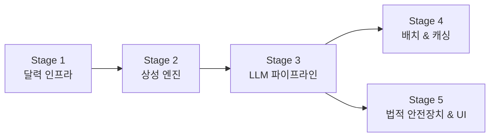

# 한국향 띠별 일일 운세 서비스 종합 구축 계획

PDF 가이드라인 문서 "띠별 운세 서비스 구축 가이드라인"의 전체 9개 챕터를 분석하여, 현재 구축된 MVP 코드베이스를 가이드라인 수준으로 고도화하는 단계별 실행 계획입니다.

---

## 현재 상태 vs 가이드라인 요구 수준 (Gap 분석)

| 영역 | 현재 MVP 상태 | 가이드라인 요구 수준 |
|------|-------------|-------------------|
| **역법/달력** | 양력 날짜만 사용, 요일 정도만 저장 | KASI 기반 음양력·일진·24절기·특일 정보 완비 |
| **띠 계산** | 양력 연도 % 12 단순 계산 | `korean-lunar-calendar` 라이브러리 기반 정밀 변환 |
| **운세 알고리즘** | 없음 (더미 텍스트) | 12지신 × 일진 상성 모델 (삼합/육합/상충/원진/형/파/비화) |
| **행운 요소** | 랜덤 색상/숫자 | 오행 생극제화 기반 색상·숫자·방향 산출 |
| **DB 스키마** | 3개 테이블 (간소화) | 8개 이상 테이블 (정적 달력 + 동적 콘텐츠 + 규칙 엔진 분리) |
| **운세 섹션** | 단일 텍스트 (총평/금전/애정) | 섹션별 분리 테이블 (총평/재물/애정/직장/건강) |
| **LLM 프롬프트** | Mock 함수 (실제 호출 없음) | 시스템 프롬프트(페르소나) + 사용자 프롬프트(동적 변수) 체이닝 |
| **배치 생성** | 없음 (요청 시 즉시 생성) | 30일치 사전 생성 배치 스케줄러 |
| **캐싱** | 없음 | Redis/인메모리 캐싱 (TTFB 50ms 이하) |
| **법적 안전장치** | 없음 | 면책 조항, 개인정보 처리방침, 콘텐츠 가드레일 |

---

## 구현 단계 (5단계)

### 🔷 Stage 1: 달력 인프라 및 역법 엔진 구축
> 가이드라인 챕터 2 "역법 체계의 이해와 달력 데이터 인프라" 대응

모든 운세 생성의 기반이 되는 **정확한 달력 데이터 시스템**을 먼저 완성합니다.

#### [MODIFY] [schema.prisma](file:///Users/ken/Projects/Ken/zodiac_signs/prisma/schema.prisma)
- `CalendarDate` 모델에 `lunarYear`, `ganjiYear`, `ganjiMonth`, `ganjiDay`, `julianDay` 등 간지/음력 필드 확장
- `SolarTerm` (24절기 마스터) 모델 신규 추가
- `CalendarSpecialDay` (특일 정보) 모델 신규 추가
- `SexagenaryCycle` (60갑자 마스터) 모델 신규 추가

#### [NEW] src/lib/lunar-calendar.ts
- `korean-lunar-calendar` NPM 패키지 연동
- 양력 → 음력/간지 변환 유틸리티 구현
- KASI API 없이도 오프라인에서 즉시 변환 가능한 구조

#### [NEW] scripts/seed-calendar.ts
- 2024년~2030년(약 7년치) `calendar_dates` 일괄 적재 스크립트
- 각 날짜별 음력, 일진(간지), 24절기, 공휴일 여부를 미리 계산하여 저장
- `solar_terms` 24절기 마스터 데이터 적재

---

### 🔷 Stage 2: 명리학 상성 엔진 (Rule Engine) 구축
> 가이드라인 챕터 3 "명리학적 수리 모델과 운세 알고리즘" 대응

현재 "랜덤 점수 + 더미 텍스트" 구조를 **역학적 근거가 있는 점수 산출 엔진**으로 교체합니다.

#### [NEW] src/lib/fortune-engine.ts — 상성 점수 산출 엔진
PDF 가이드라인의 핵심 테이블을 코드로 구현:

| 관계 유형 | 점수 보정 | 콘텐츠 톤 |
|-----------|---------|----------|
| 삼합/육합 | +20% | 귀인 등장, 협력, 순조로움 |
| 상충 | -15% | 변화, 이동, 금전 주의 |
| 원진 | -10% | 감정 조절, 양보 촉구 |
| 형/파 | -10% | 문서 주의, 무리한 확장 자제 |
| 비화 | ±0% | 경쟁/동료애 양면성 |

#### [NEW] src/lib/lucky-elements.ts — 오행 기반 행운 요소 산출
- 일진의 오행 분석 → 용신(보완 오행) 결정
- 용신에 매핑된 행운의 색상, 숫자, 방향 자동 반환
  - 목(木): 청/녹색, 3/8, 동쪽
  - 화(火): 적/분홍, 2/7, 남쪽
  - 토(土): 황/베이지, 5/10, 중앙
  - 금(金): 백/은색, 4/9, 서쪽
  - 수(水): 흑/네이비, 1/6, 북쪽

#### [NEW] src/data/zodiac-relations.ts — 12지신 상성 매핑 데이터
- 12×12 = 144가지 지지 간 관계 매트릭스 정의 (삼합, 육합, 상충, 원진, 형, 파, 비화)

---

### 🔷 Stage 3: LLM 프롬프트 엔지니어링 및 콘텐츠 파이프라인
> 가이드라인 챕터 5 "콘텐츠 생성 파이프라인", 챕터 6 "LLM 프롬프트 엔지니어링 심층 설계" 대응

Mock 함수를 **실제 LLM API를 호출하는 고도화된 프롬프트 체이닝 파이프라인**으로 교체합니다.

#### [MODIFY] src/lib/generator.ts — 4단계 파이프라인 구현
1. **달력 컨텍스트 추출**: `calendar_dates`에서 일진, 절기, 특일 조회
2. **상성 점수 산출**: Stage 2의 엔진으로 오늘 띠의 종합 점수·톤 결정
3. **프롬프트 조립 (Prompt Chaining + Template Injection)**: 절기/점수 맥락에 맞는 템플릿 선택 후, 행운 요소와 띠 정보를 동적 주입
4. **LLM 호출 및 JSON 파싱**: Structured Output 강제, 글자 수 검증 후처리

#### [NEW] src/lib/prompts.ts — 시스템/사용자 프롬프트 정의
**시스템 프롬프트** (PDF 6.1절 그대로 반영):
> "당신은 한국 사주명리학과 심리학에 통달한 30년 경력의 전문 카운슬러입니다..."
> - 경어체 유지, 난해한 한자 용어는 현대적 은유로 번역
> - 극단적 흉운/공포 조장 표현 금지
> - JSON 스키마 엄수

**사용자 프롬프트 템플릿** (PDF 6.2절 반영):
> - 타겟 띠, 오늘 날짜, 일진, 역학적 관계성(점수), 행운 보완 요소를 동적 주입
> - 총평 200자, 재물/직장운 150자, 애정운 150자 등 글자 수 제한

#### [MODIFY] prisma/schema.prisma — 콘텐츠 테이블 고도화
- `DailyFortune` 모델에 `luckyDirection`, `toneType` 등 필드 추가
- `DailyFortuneSection` 모델 신규 추가 (섹션별 본문 분리: overall, career_wealth, love, health)
- `FortuneTemplate` 모델 신규 추가 (절기/점수 맥락별 프롬프트 템플릿 관리)

---

### 🔷 Stage 4: 배치 스케줄러 및 캐싱 인프라
> 가이드라인 챕터 7 "인프라 설계 및 성능 최적화 전략" 대응

실시간 LLM 호출 대신 **30일치 사전 생성 + 캐시 응답** 구조로 전환합니다.

#### [NEW] scripts/batch-generate.ts — 사전 생성 배치 스크립트
- 미래 30일 × 12띠 = 360건의 운세를 심야 시간대에 비동기 생성
- 실패한 항목 재시도 로직 포함
- `generation_logs` 테이블에 프롬프트 해시, 모델 버전, 생성 시각 기록

#### [MODIFY] src/app/api/fortunes/route.ts — 캐싱 계층 도입
- **1차**: 인메모리 캐시(Node.js Map 또는 lru-cache) — 당일 12띠 운세를 JSON 덩어리로 보관
- **2차**: DB 조회 (캐시 미스 시에만)
- 자정 직전 다음날 캐시를 워밍(Warming)하는 로직

> [!NOTE]
> 초기에는 Node.js 내장 인메모리 캐시로 시작하고, 트래픽 증가 시 Redis로 전환하는 점진적 접근을 권장합니다. MVP 단계에서 Redis 인프라까지 세팅하면 오버엔지니어링이 될 수 있습니다.

---

### 🔷 Stage 5: 법적 안전장치 및 UI 고도화
> 가이드라인 챕터 8 "법적 리스크 관리, 윤리적 가이드라인 및 운영 정책" 대응

#### [MODIFY] src/app/page.tsx — UI 고도화
- 운세 결과를 **섹션별 탭/아코디언 UI**로 분리 (총평, 재물운, 애정운, 직장운, 건강운)
- 행운 요소(색상·숫자·방향)를 시각적인 **행운 보고서 카드** 형태로 렌더링
- 하단에 **법적 면책 조항(Disclaimer)** 고정 배치:
  > "본 운세 정보는 전통 명리학에 기반한 통계적 해석일 뿐이며, 법적, 의학적, 재정적 결정의 근거로 사용될 수 없는 엔터테인먼트 목적의 콘텐츠입니다."

#### [NEW] src/app/privacy/page.tsx
- 개인정보 처리방침 페이지 (띠 선택 방식이므로 최소 수집, 목적 및 파기 정책 명시)

#### 콘텐츠 안전 가드레일 (generator.ts 내 후처리)
- LLM 응답에서 금지어(극단적 흉운, 생명 위협, 파산 등) 필터링 로직
- 모델 드리프트 대응: 점수·길흉 방향은 룰 엔진에서 하드코딩, LLM은 '구두화(Verbalize)' 역할에만 국한

---

## 단계별 의존성 및 우선순위

- **Stage 1 → 2 → 3**은 순차적 의존 관계 (달력 데이터가 있어야 상성 계산 가능, 상성 점수가 있어야 프롬프트 주입 가능)
- **Stage 4와 5**는 Stage 3 완료 후 병렬 진행 가능

## Verification Plan

### Automated Tests
- `korean-lunar-calendar`로 변환한 음력/간지 값이 KASI 공식 데이터와 일치하는지 검증
- 상성 엔진이 알려진 삼합(인오술, 해묘미 등) 관계를 정확히 판별하는지 단위 테스트
- LLM 응답의 JSON 파싱 및 글자 수 제한 준수 여부 검증

### Manual Verification
- 브라우저에서 특정 띠를 선택했을 때 섹션별 운세가 올바르게 표시되는지 확인
- 면책 조항이 화면 하단에 항상 노출되는지 확인
- 배치 스크립트 실행 후 30일치 운세가 DB에 정상 적재되었는지 확인
